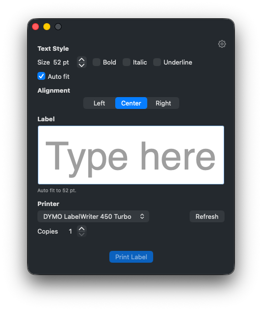

# Label Baby Jr

A native macOS app for designing and printing rich-text labels on DYMO label printers.

Label Baby Jr is a lightweight, document-based label editor built with SwiftUI and AppKit. It's purpose-built for a single label size (89×28mm, DYMO's standard) with a focused set of rich text formatting tools, so you can go from a blank label to a printed one in seconds.



## Features

- **Rich text editing** — bold, italic, underline, font size, and left/center/right alignment
- **Auto-sizing text** — text starts large and shrinks as you type so it always fits the label; pick a max size, or turn auto-size off and set sizes by hand
- **WYSIWYG label preview** — an enlarged, print-accurate editor view of the 89×28mm label
- **DYMO printing** — printer picker (automatically filtered to DYMO printers only) with a copies stepper
- **Document-based** — labels are saved as `.labelbabyjr` files (a simple JSON format) and integrate with macOS's standard Open Recent / document handling
- **Home screen** — a recent labels picker showing thumbnail previews, with a "Create New Label" button
- **Settings** — choose whether the app launches to the recent labels picker or a blank new label

## Requirements

- macOS 15 (Sequoia) or later to run
- Xcode 26 or later to build (the project uses some newer Swift language features)

## Building

1. Clone the repo and open `Label Baby Jr.xcodeproj` in Xcode.
2. Select the **Label Baby Jr** scheme with the **My Mac** run destination.
3. Build and run (`⌘R`).

To build a distributable, signed, and notarized copy for sharing outside the Mac App Store, archive via **Product → Archive**, then use Xcode's Organizer to distribute with **Direct Distribution** (Developer ID signing + notarization).

## The `.labelbabyjr` file format

Labels are saved as JSON documents describing the label size and an ordered list of text "runs," where each run carries its own font size, bold/italic/underline flags, and alignment:

```json
{
  "formatVersion": 1,
  "labelSize": { "widthMM": 89, "heightMM": 28 },
  "autoSize": true,
  "maxFontSize": 52,
  "runs": [
    { "text": "Hello", "fontSize": 14, "bold": true, "italic": false, "underline": false, "alignment": "center" }
  ]
}
```

## Project structure

| File | Responsibility |
| --- | --- |
| `LabelBabyJrApp.swift` | App entry point; sets up the home window and the document-based editor scene |
| `ContentView.swift` | Editor screen; binds the document to the `LabelEditorController` |
| `EditableLabelView.swift` | The `NSTextView`-backed rich text editor and its SwiftUI wrapper |
| `LabelEditorController.swift` | Editor state (style, selection) and document change notifications |
| `LabelBabyJrDocument.swift` / `LabelBabyJrFileFormat.swift` | Document type and the `.labelbabyjr` file format |
| `PrinterService.swift` / `LabelPrintView.swift` | DYMO printer discovery and print rendering |
| `HomeView.swift` / `RecentLabelsStore.swift` | Recent labels home screen and persistence |
| `SettingsView.swift` / `AppSettings.swift` | App preferences |
| `LabelTypography.swift` | Shared label size, font, and margin constants |
| `LabelAutoFitSizer.swift` | Binary-search sizer that finds the largest whole-point font that still fits |

## License

Released under the [MIT License](LICENSE).
